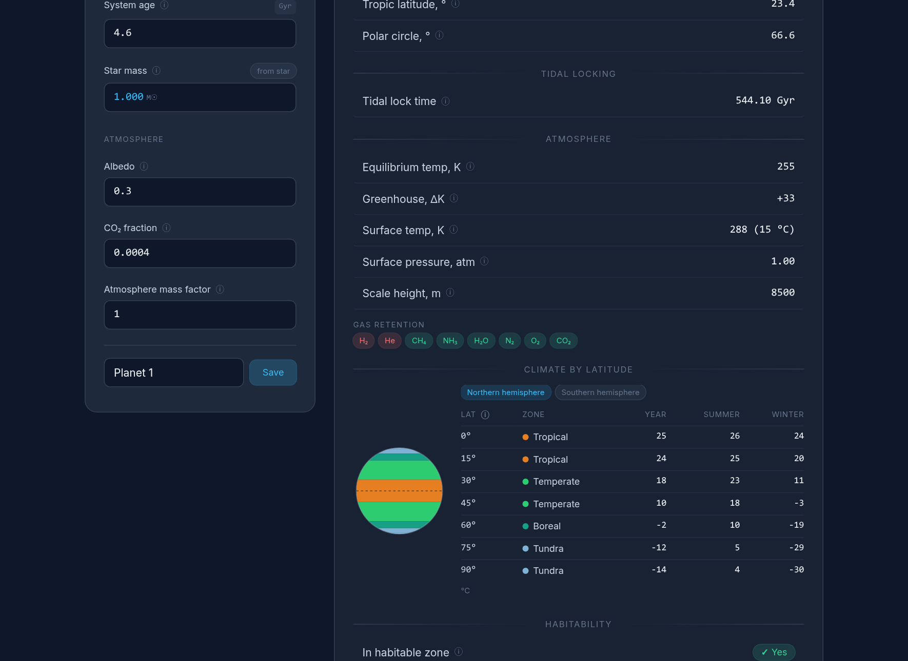

# Terrasynth

Worldbuilding astronomy calculator — design a star system and get the physics for free: **star → planets → moons**, from luminosity and habitable zones down to latitude climate bands and moon resonances. Runs entirely in the browser (Rust → WebAssembly), bilingual (English / Русский).



## Features

**★ Star**
- Mass → luminosity, temperature & spectral class, radius, lifetime, peak emission wavelength
- Habitable zone, frost line, planet-forming boundaries
- Binary systems: S-type / P-type critical orbits, combined luminosity & habitable zone, orbital period
- Flora pigment prediction: what color plants would evolve under this star

**◉ Planets**
- Any number of planets per system, each with its own name and parameters
- In binary systems each planet picks its host: star A, star B, or both (circumbinary)
- Type by mass (rocky / sub-Neptune / gas giant / super-Jovian), auto or manual radius
- Gravity, density, escape velocity, surface area & volume
- Orbit: period & velocity, perihelion/aphelion from eccentricity
- Axial tilt → tropics & polar circles, habitability checks
- Atmosphere: equilibrium & surface temperature, greenhouse effect, scale height, per-gas retention
- Tidal locking time vs. system age
- Latitude climate model: insolation with axial tilt, orbital eccentricity & perihelion longitude, heat transport, seasonal extremes, simplified Köppen zones per 15° band — hemisphere tabs and a colored planet disc

**☽ Moons**
- Named moons attached to any planet of the system
- Hill sphere & stable orbit limit, Roche limit
- Mass, gravity, angular size in the sky, orbital period
- Multi-moon stability per planet: spacing checks & mean-motion resonance warnings

**⊚ System**
- Top-view map of the whole system on a log-distance scale: star(s) colored by spectral class, habitable zone, frost line, every planet's eccentric orbit with its name, binary S/P-type stability limits
- Moon system strip per planet: Roche zone, moon orbits, stable orbit limit
- Full summary of every object — star(s), planets, moons — in one place

Plus: save & compare worlds side by side, copy as Markdown, share a world (planets, moons & names included) via URL hash, RU/EN switch, inputs persisted in localStorage.

An illustrated in-app reference — a glossary of every input and output — is brewing in the [`beta`](https://github.com/Allin-Li/terrasynth/tree/beta) branch.

## Project layout

```
astro_lib/   pure physics: stars, binaries, orbits, atmosphere, tidal, climate, moons, flora
astro_web/   Leptos 0.8 (CSR) + Tailwind UI, leptos_i18n locales (en/ru)
```

`astro_lib` has no UI dependencies and is covered by unit tests pinned to real-world values — Earth's climate bands, Mars' seasonal asymmetry, the Moon's angular size:

```
cargo test -p astro_lib
```

## Models & accuracy

Deliberately simplified but calibrated: standard main-sequence scaling relations, an energy-balance climate with Köppen-style zones, thermal-escape gas retention. The goal is plausible worlds for fiction, not research-grade numbers: every model is a documented approximation tuned to reproduce Solar System benchmarks.
